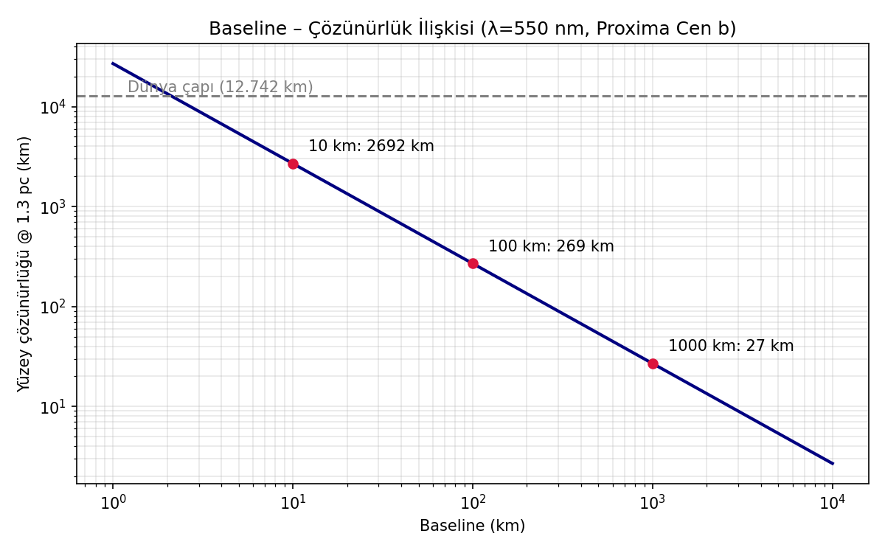
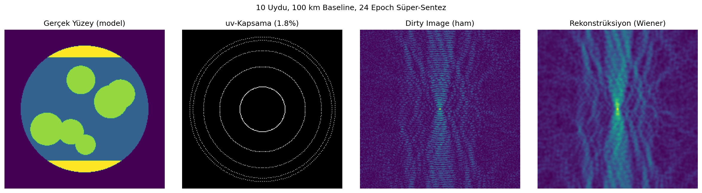

# 🪐 Mapping Alien Worlds

**AI-Coordinated Space Optical Interferometry for Direct Imaging of Exoplanet Surfaces**

[]()
[]()
[]()

> Can we photograph continents on a planet orbiting another star? We believe the answer is yes — with a formation-flying swarm of small satellites acting as a single 100+ km optical telescope, coordinated and reconstructed by AI.

---

## 🔭 The Concept

- **Distributed aperture**: 10–20 small satellites in precision formation flight → optical interferometer with 100–1000 km baselines
- **Dynamic hierarchical nulling**: suppressing host-star light to reveal the planet
- **AI-driven reconstruction**: recovering surface maps from extremely sparse uv-plane data (~2% coverage)

At λ = 550 nm and a 100 km baseline, the diffraction limit at 1.3 pc (Alpha/Proxima Centauri) corresponds to **~250 km surface resolution** — enough to map continents, oceans, and ice caps.



## 📊 Simulation Results

Our uv-plane simulation (10 satellites, 100 km circular array, 24-epoch super-synthesis) achieves only **~1.8% uv coverage** — demonstrating why classical imaging fails and AI-based sparse reconstruction is essential.



*Left to right: ground-truth surface model, uv coverage, dirty image, Wiener reconstruction.*

## 🌟 Two Target Scenarios

| | Scenario A: Alpha Cen A + Earth-like | Scenario B: Proxima b (real planet) |
|---|---|---|
| Star | G2V, V=0.01 (bright) | M5.5V, V=11.13 (~26,000× fainter) |
| Contrast | ~10⁻¹⁰ | ~8×10⁻⁸ (**~760× better**) |
| Regime | Photon-rich, null-limited | Photon-limited, null-relaxed (~10⁻⁶) |
| Separation | ~930 mas | ~37 mas (harder IWA) |

Full analysis: [docs/technical_overview.md](docs/technical_overview.md)

## 📁 Repository Structure

```
simulations/   # Python simulation code (baseline analysis, uv-plane synthesis)
figures/       # Generated figures
docs/          # Technical overview
```

## 🚀 Quick Start

```bash
git clone https://github.com/mapping-alien-worlds/mapping-alien-worlds.git
cd mapping-alien-worlds
pip install numpy scipy matplotlib
python simulations/uv_plane_sim.py
```

## 🧩 Scientific Context

- **NASA NIAC 2026** — Paul Stankus (Brookhaven), *"Mapping Alien Continents: Achieving Optical VLBI for Exoplanet Imaging"*
- **LIFE** (Large Interferometer For Exoplanets) — ETH Zürich, mid-IR nulling formation-flying concept
- **SILVIA** (JAXA) — precision formation-flying demonstration

## 🗺️ Roadmap

- [x] Baseline–resolution feasibility analysis
- [x] Sparse uv-plane synthesis simulation
- [x] Two-scenario photon budget (Alpha Cen A vs Proxima b)
- [ ] AI reconstruction benchmark (diffusion prior vs. CLEAN/Wiener)
- [ ] End-to-end photon budget & nulling model
- [ ] Formation-flight OPD stabilization requirements study
- [ ] Community white paper

## 🤝 Contributing

We welcome astronomers, ML researchers, and space systems engineers. Open an issue or start a discussion — see `CONTRIBUTING.md` (coming soon).

## 📄 License

MIT License — free to use, modify, and distribute with attribution.

## 👤 Author

**Gökhan Can** — Concept originator & project lead

## 📬 Contact

Open a [GitHub Issue](../../issues) or reach out via Discussions.

---
*© 2026 Gökhan Can — MIT License*
